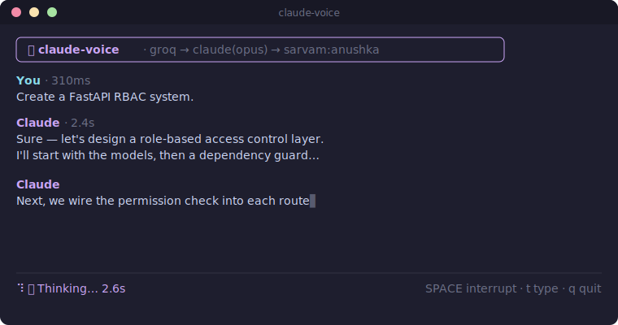

<div align="center">

# 🎙️ Claude Voice AI

**Real-time voice conversations for the [Claude CLI](https://claude.com/claude-code).**

Talk to Claude naturally from your terminal — speak, and hear it think back.

[](https://github.com/aayushdebugging/claude-voice/actions/workflows/ci.yml)
[](https://www.npmjs.com/package/@aayushdebugging/claude-voice)
[](./LICENSE)
[](https://nodejs.org)



</div>

---

`claude-voice` is a **native voice layer on top of the Claude CLI**, not a
speech-to-text wrapper. You speak; your words are transcribed and sent to
`claude`; the streamed response is printed live **and spoken aloud sentence by
sentence** as it is generated. Start talking again at any time and it stops,
listens, and hands your interruption straight to Claude — like pair programming
out loud.

## ✨ Features

- 🎤 **Speak to Claude** — continuous listening with silence detection, or push-to-talk.
- 🧠 **Wraps the Claude CLI** — uses your existing `claude` install and session; **no Claude API key required**.
- 🔊 **Speaks as it thinks** — responses are streamed to TTS one complete sentence at a time, so audio starts almost immediately.
- ✋ **Barge-in / interruption** — cut in mid-sentence; playback and generation stop instantly and it starts listening again.
- 🔌 **Pluggable providers** — Groq Whisper (default) or any OpenAI-compatible STT; ElevenLabs or Sarvam TTS. Add your own.
- 🩺 **`doctor`** — one command verifies your CLI, keys, mic, speaker, and network.
- 🧩 **Extensible** — an event-driven core with a plugin API for wake-words, clipboard, memory, notifications, MCP, and more.
- 🎨 **Polished, branded TUI** — an [Ink](https://github.com/vadimdemedes/ink)-powered **Claude Voice AI** interface: a gradient-branded header with a persistent watermark, a spinner that shimmers through the brand palette, a scrollback transcript, live token streaming, colored role labels (`❯ You`, `✦ Claude`), and a status bar with a mic meter + timings.
- ⌨️ **Talk or type** — press **`t`** to type a message instead of speaking, so you can use it even without a working mic.

## 🚀 Quick start

```bash
# 1. Install globally
npm install -g @aayushdebugging/claude-voice

# 2. Make sure the Claude CLI is installed and logged in
#    https://claude.com/claude-code
claude --version

# 3. Set your provider keys (see "Configuration" below)
export GROQ_API_KEY="…"        # speech-to-text
export ELEVENLABS_API_KEY="…"  # text-to-speech

# 4. Check everything is wired up
claude-voice doctor

# 5. Talk to Claude
claude-voice
```

You'll also need a microphone recorder backend and audio output:

| Platform | Install |
| --- | --- |
| macOS | `brew install sox` (and `brew install ffmpeg` for gapless streaming) |
| Debian/Ubuntu | `sudo apt-get install sox libsox-fmt-all alsa-utils ffmpeg` |
| Windows | [Install SoX](https://sourceforge.net/projects/sox/) and add it to `PATH` |

> `ffmpeg` (its `ffplay`) is optional but recommended: it enables **gapless** streamed speech. Without it, playback falls back to `afplay`/`aplay` clips (still works, with a tiny seam between sentences).

See the [Installation guide](./docs/INSTALLATION.md) for details and troubleshooting.

## 🎛️ Usage

```bash
claude-voice                      # start a conversation (continuous mode)
claude-voice --model opus         # pick a Claude model (opus | sonnet | fable)
claude-voice --voice river        # pick a TTS voice
claude-voice --stt groq           # choose the speech-to-text provider
claude-voice --tts sarvam         # choose the text-to-speech provider (elevenlabs | sarvam)
claude-voice --push-to-talk       # press SPACE to talk instead of continuous
claude-voice --no-speak           # text only, no spoken responses
claude-voice --language hi        # set STT + TTS language (ISO-639-1) or "auto"
claude-voice --speed 1.5          # speech rate multiplier, 0.5–3.0 (1 = natural)
claude-voice --no-stream          # speak the whole reply at once (default: as it streams)
claude-voice --local              # fully-local, free stack (whisper.cpp + Kokoro)
```

**In-session keys** (default push-to-talk):

| Key | Action |
| --- | --- |
| **SPACE** | tap to start talking → it auto-stops when you finish speaking and transcribes. Tap again to send immediately, or to interrupt while Claude is replying. |
| **`t`** | type a message instead of speaking (Enter sends, Esc cancels, ↑/↓ recalls previous prompts) |
| **`/`** | open the command palette |
| **`q`** / **Ctrl-C** | quit |

**Command palette** (press `/`):

| Command | Action |
| --- | --- |
| `/help` | show keys & commands |
| `/clear` | clear the transcript |
| `/mute` · `/speak` | toggle spoken responses on the fly |
| `/voice <name>` | switch the TTS voice live (e.g. `/voice karun`) |
| `/model <name>` | switch the Claude model (opus/sonnet/fable) for the next turn |
| `/speed <rate>` | set the speech rate live — `0.5`–`3.0` (e.g. `/speed 1.5` or `/speed 2x`) |
| `/lang <code>` | switch language for STT + TTS (e.g. `/lang hi`, `/lang auto`) |
| `/stream` | toggle speaking-as-Claude-writes vs speaking the whole reply at once |
| `/quit` | exit |

While listening, a live **mic-level meter** in the status bar fills green as it hears you, so you always know the mic is working. Claude's answer streams to the screen as it's written and is **spoken as it streams** — each sentence is synthesized *ahead* of playback, so audio starts right after the first sentence instead of after the whole reply (a big difference on long answers).

For **gapless** streaming, install `ffmpeg` (`brew install ffmpeg`): the reply is fed sentence-by-sentence into a single persistent audio stream (`ffplay`), which waits during pauses rather than reopening the device — so it sounds like one continuous answer. Without a streaming player it falls back to playing a few back-to-back clips via `afplay` (a small seam between clips), and `--no-stream` (or `/stream`) speaks the whole reply at once with no seams at all. sox `play` is intentionally not used for streaming — it cuts off on the first pause.

While Claude generates, the status bar shows a live **word count and words/sec**, and each reply is tagged with its time and length (e.g. `Claude · 2.4s · 45w`).

> The rich UI needs a real terminal. When output is piped or `CLAUDE_VOICE_PLAIN=1` is set, it falls back to a plain streaming UI.

### Commands

| Command | What it does |
| --- | --- |
| `claude-voice` / `claude-voice chat` | Start a live voice conversation. |
| `claude-voice serve` | Host a remote voice client on your Wi-Fi — talk to Claude from your phone. |
| `claude-voice say "<text>"` | Speak a phrase aloud with the configured voice (no mic needed). |
| `claude-voice config` | View or edit configuration. |
| `claude-voice local` | Set up / check the fully-local, free stack (whisper.cpp + Kokoro). |
| `claude-voice doctor` | Diagnose your setup (CLI, keys, mic, speaker, network). |
| `claude-voice update` | Check for and install the latest version. |
| `claude-voice version` | Print the installed version. |

## ⬆️ Updating

Already installed it? Upgrade to the latest published version:

```bash
# global install:
npm install -g @aayushdebugging/claude-voice@latest

# or, if it's a project dependency:
npm update @aayushdebugging/claude-voice
```

From **v0.1.2** onward you can also self-update in place:

```bash
claude-voice update          # checks npm and installs the newest version
claude-voice update --check  # just check, don't install
claude-voice version         # what you're on now
```

> Note: `npm update` takes a bare package name (no `@latest`); use `npm install …@latest` to force the newest, or `npm update …` to move within your saved range.

## 🔒 Fully local & free (no API keys)

Run entirely offline with open-source models — no cloud, no keys, $0:

- **STT:** [whisper.cpp](https://github.com/ggml-org/whisper.cpp) (Metal-accelerated on Apple Silicon)
- **TTS:** [Kokoro](https://github.com/hexgrad/kokoro) via any OpenAI-compatible server (e.g. `kokoro-fastapi`)

```bash
claude-voice local     # checks status + AUTO-DOWNLOADS the whisper model, prints setup commands
```

`claude-voice local` fetches the whisper.cpp model (~150 MB) for you with a progress bar; Kokoro downloads its own model on first run. Pass `--no-download` to just print the commands instead. (You still install the runtimes once — `brew install whisper-cpp uv` — since those are native/Python, not npm.)

Once both local servers are up:

```bash
claude-voice --stt whispercpp --tts kokoro
# or make it the default:
claude-voice config --set stt=whispercpp --set tts=kokoro --set voice=af_heart
```

Any OpenAI-compatible STT/TTS server works too (point `providers.whispercpp.baseUrl` / `providers.kokoro.baseUrl` at it).

## 📱 Talk from your phone (remote)

Run a token-protected voice session on your machine and drive it from your phone on the same Wi-Fi — hands-free with headphones:

```bash
claude-voice serve
```

It prints a link and a **QR code**. Scan it (or open the link) on your phone:

1. Accept the one-time certificate warning (it's a self-signed cert — needed so the phone's browser will allow microphone access on the LAN).
2. Allow microphone access.
3. **Hold the button, speak, release.** Your words are transcribed on your machine, sent to Claude, and the reply streams back as text and **plays aloud on the phone**. Tap **Stop** to cut off a reply, or type instead.

> **Safe by default.** A remote session runs with **all of Claude's tools disabled** — it can talk, but it can't run shell commands, edit files, or read your disk. The link carries a secret token, but anyone on your network who has it can talk to Claude on your machine, so only share it with yourself.

```bash
claude-voice serve --host 127.0.0.1   # keep it on this machine only
claude-voice serve --port 8080        # change the port
claude-voice serve --max-clients 2    # cap simultaneous devices
claude-voice serve --allow-tools      # DANGER: let remote prompts run tools
```

Please read [SECURITY.md](./SECURITY.md) before using `--allow-tools` or exposing the server on an untrusted network.

## 🔑 Configuration

Configuration lives at `~/.claude-voice/config.json`. **API keys are never
stored there** — they are read from environment variables:

| Provider | Env var |
| --- | --- |
| Groq (STT, default) | `GROQ_API_KEY` |
| OpenAI (STT) | `OPENAI_API_KEY` |
| ElevenLabs (TTS, default) | `ELEVENLABS_API_KEY` |
| Sarvam (TTS) | `SARVAM_API_KEY` |

```jsonc
{
  "stt": "groq",              // "groq" | "openai"
  "tts": "elevenlabs",        // "elevenlabs" | "sarvam"
  "voice": "aria",            // TTS voice name
  "model": "opus",            // Claude model alias
  "pushToTalk": false,        // continuous vs push-to-talk
  "autoSpeak": true,          // speak responses aloud
  "streamSpeech": true,       // speak as Claude writes (vs the whole reply at once)
  "voicePrompt": "…",         // steers Claude to answer in a voice-friendly way ("" disables)
  "language": "auto",         // STT + TTS language (ISO-639-1) or "auto"
  "speechRate": 1.0,          // speech rate multiplier, 0.5–3.0 (1 = natural)
  "silenceTimeoutMs": 1500,   // silence that ends an utterance
  "micSensitivity": 150,      // lower = picks up quieter mics; higher = ignores noise
  "sampleRate": 16000
}
```

Manage it from the CLI:

```bash
claude-voice config                       # print current config + path
claude-voice config --edit                # open in $EDITOR
claude-voice config --set voice=river --set model=sonnet
claude-voice config --get providers.groq.model
claude-voice config --reset               # restore defaults
```

## 🧠 How it works

```
🎤 Microphone → 📝 Speech-to-Text → 🤖 Claude CLI (stream-json)
        ↑                                     ↓
   barge-in                          🔎 Sentence parser
        ↑                              ↓            ↓
  🔊 Speakers ← 🗣️ TTS queue ←──────────┘     🖥️ Terminal (live tokens)
```

Claude's output is streamed token-by-token. A streaming **sentence parser**
accumulates tokens until a sentence completes (`.`, `?`, `!`, or a paragraph
break), then hands each finished sentence to an **interruptible speech queue**
so audio begins while Claude is still generating. Every stage communicates over
a typed **event bus**, so the UI, plugins, and providers stay decoupled.

Read the full [Architecture guide](./docs/ARCHITECTURE.md).

## 🧩 Programmatic use

`claude-voice` is also a library. The CLI is a thin layer over these primitives:

```ts
import { createSession, loadConfig } from '@aayushdebugging/claude-voice';

const config = await loadConfig({ model: 'opus', voice: 'river' });
const { conversation, bus } = createSession({ config });

bus.on('SpeechRecognized', ({ text }) => console.log('You said:', text));
bus.on('ClaudeToken', ({ text }) => process.stdout.write(text));

await conversation.start(); // Ctrl-C to stop
```

See the [API documentation](./docs/API.md) for the full surface, including how
to write custom STT/TTS providers and plugins.

## 🩺 Troubleshooting

Run `claude-voice doctor` first — it pinpoints most issues. Common ones:

- **"Claude CLI not found"** — install it from <https://claude.com/claude-code> and ensure `claude` is on your `PATH`.
- **"recording backend not found"** — install `sox` (see the table above).
- **"speaker module unavailable"** — the optional native audio module failed to build; install your platform's build tools and reinstall. `--no-speak` works meanwhile.
- **401 from a provider** — double-check the corresponding `*_API_KEY`.

## 🔐 Security

`claude-voice` drives the Claude CLI — a capable agent — from your voice. Local
sessions have full tool access (like your terminal); **remote (`serve`) sessions
disable all tools by default** so a spoken or injected prompt can't run commands
or touch your files. Before exposing a server or using `--allow-tools`, read
[**SECURITY.md**](./SECURITY.md) for the threat model and safe-use guidance. To
report a vulnerability, see the reporting section there (please don't file a
public issue).

## 🤝 Contributing

Contributions are very welcome! See the [Contributing guide](./docs/CONTRIBUTING.md)
for the dev setup, coding standards, and how to add a provider or plugin.

## 📄 License

[MIT](./LICENSE) © claude-voice contributors
